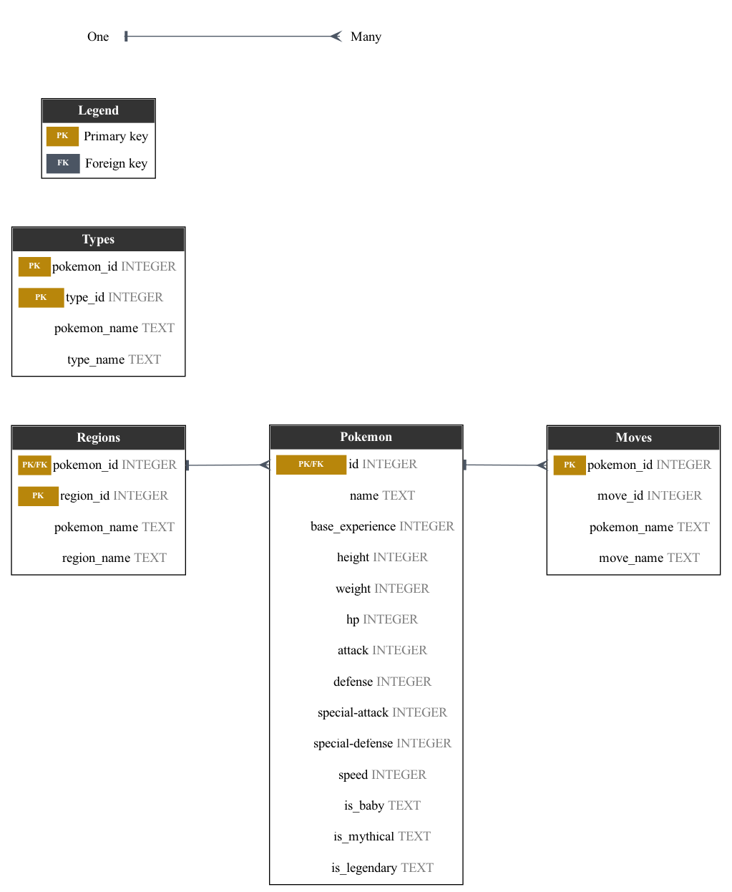

# Data Viz Trial

Small trial project: load Pokemon CSV data into a SQLite DB (`csv_to_sqlite.py`)
and generate an ER diagram of its schema with Graphviz (`db_diagram.py`).

```
uv run csv-to-sqlite   # build the SQLite DB from CSVs
uv run db-diagram POKEDB -o pokedb_diagram   # render the schema diagram
```


